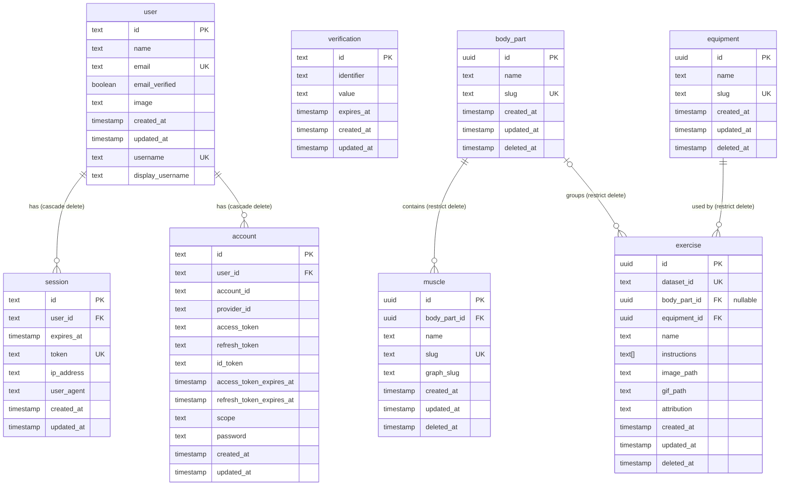

# Database Structure

Entity relation diagram of the current PostgreSQL schema, generated from the Drizzle schemas in `database/src/schemas/` and `database/src/relations.ts`.

## Notes

- `user`, `session`, `account` and `verification` are the auth tables (better-auth). `verification` has no foreign keys.
- `body_part`, `muscle`, `equipment` and `exercise` are soft-deleted via `deleted_at`.
- `muscle.graph_slug` is stored as text but constrained in Zod to the region ids used by `react-muscle-highlighter`.
- `exercise` rows are imported from the exercises dataset by the seeder. `dataset_id` is the dataset's four-digit id and the seeder's upsert key. `image_path` and `gif_path` are relative to the media root served by nginx under `/media/`.
- `exercise.body_part_id` is nullable: cardio exercises have no body region.
- Which muscles an exercise works is not stored on `exercise`; that will live in an `exercise_muscle` junction table (not yet created).
- Indexes: `session.user_id`, `account.user_id`, `verification.identifier`, `muscle.body_part_id`, `exercise.body_part_id`, `exercise.equipment_id`.
